#  리그 오브 레전드(LOL) 바텀 듀오 별 승률 예측

팀원 :  김강현, 임주한

## 프로젝트 정보

### 1.  프로젝트 주제 

#### 리그 오브 레전드(LOL) 바텀 듀오 별 승률 예측

### 2.  주제 선정 배경 및 개요

   * 최근 패치를 기준으로 바텀 듀오의 조합별 게임데이터를 분석해 예측 승률이 높은 조합을 선정하여 사용자에게 제공함으로써 
   * 게임의 궁극적인 목표인 승리에 도움을 주는 서비스를 제공합니다.

### 3. 데이터 수집

* 데이터는 라이엇 게임즈 공식 API(https://developer.riotgames.com/) 를 활용해 수집

* 수집한 정보는 다음과 같은 방식으로 진행되었습니다. 

#### 각 플레이어들의 MATCH 정보

* 최상위 플레이어라는 표본을 얻기 위해 각 리그에 속해있는 플레이어들을 조회하여 해당 Summoner ID를 추출
* 해당 Summoner ID를 통해 각 플레이어들의 Account ID를 추출
* 각 Account ID를 통해 플레이어들마다 최근 100경기의 Game ID(Match ID)를 추출하여 데이터 프레임화 
* 변칙적인 플레이를 최소화하기 위해 챌린저, 그랜드마스터, 마스터, 다이아1의 최상위 플레이어들을 대상으로 약 3만개의 게임을 수집(3번에서의 유니크한 Match ID값)

#### 데이터 수집의 과정은 다음과 같습니다.

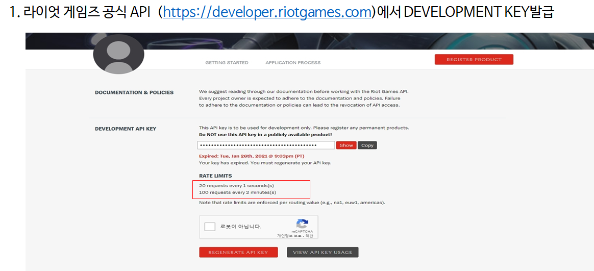

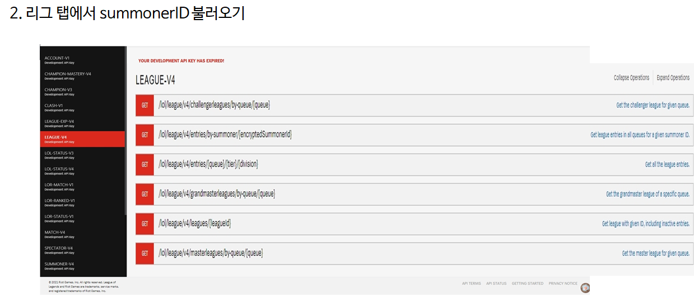

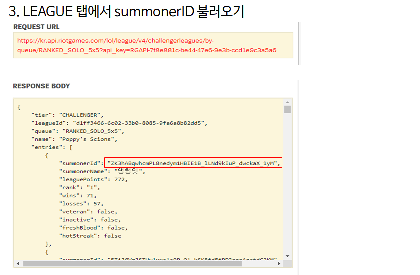

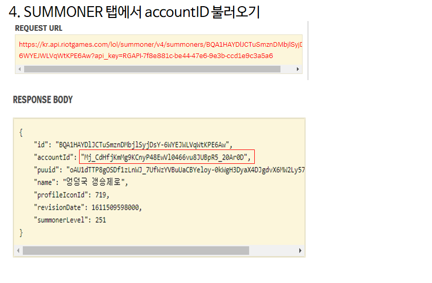

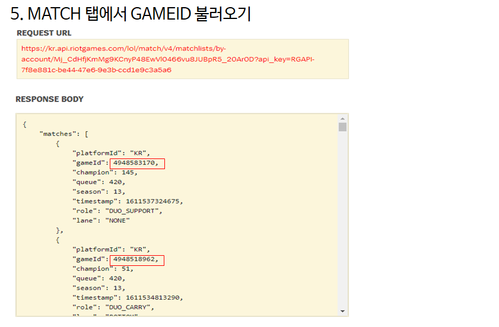

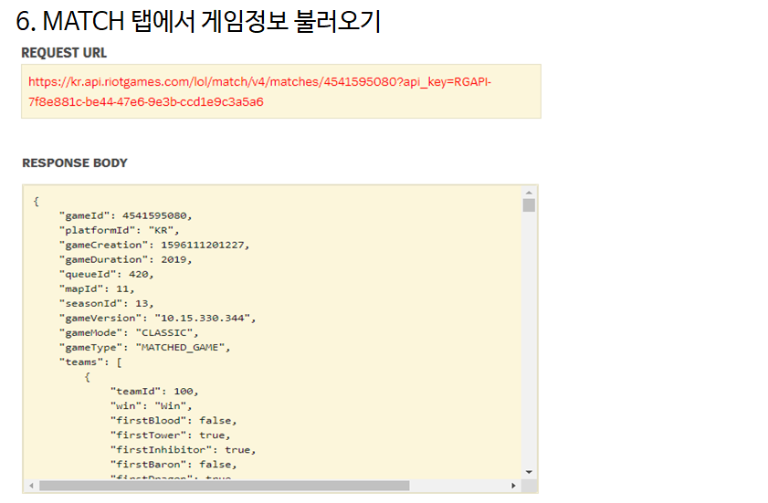

### 4. 전처리

#### 수집된 데이터에서 수행한 전처리는 다음과 같습니다.

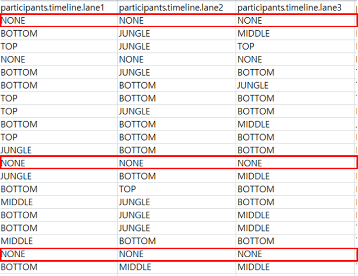

* 5명이 한팀을 이루고 있는 게임의 특성상 5명의 플레이어가  다른 포지션을 가지고 있어야 함.

* 하지만 이 포지션 값의 결측치가 발견됨.

* 각 플레이어의 라인을 재정의 할 필요성 발견

#### 이를 해결하기 위해 다음과 같은 아이디어를 사용했습니다.

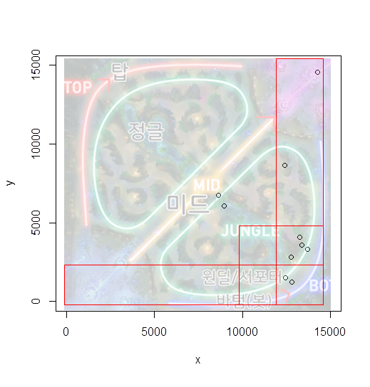

* 분석에 가장 중요한 바텀 듀오(원거리 딜러, 서포터)의 포지션이 값을 대상으로 진행했습니다.

* 각 포지션 별로 중요하게 생각한 게임적 특징은 다음과 같습니다. 

#### <원거리 딜러>

* 원거리딜러는 원거리딜러 챔피언으로 1차 분류(약 35개)

* 원거리딜러 챔피언 중 바텀에 오래있으면 원거리딜러

#### <서포터>

* 서포터는  바텀에 오래있다.

* 팀  내에서 Creep Score가  가장 낮다. 

* 다음과 같은 특징을 바탕으로 게임시작 1분마다 위치값이 찍히는 타임스탬프 데이터와 게임 분석 사이트의 원거리 딜러 분류(https://www.op.gg/champions?position=adc) 
 를 활용해 포지션 값을 재 정의 했습니다.

#### 포지션 재정의 방법

* 1차로 135개의 챔피언 중 원거리 딜러로 올 수 있는 챔피언을 먼저 걸러낸다.(33개)

* 타임스탬프를 활용해 해당 좌표 범위 안에 있을 때마다 바텀 포지션에 +1점을 한다.  

* 각 팀 플레이어(5명) 중에 원거리 딜러 챔피언이면서, 최고 포지션 점수가 바텀인 플레이어를 원거리 딜러로 정의   

#### 데이터 설명 

* 전처리가 끝난 최종 데이터 셋입니다. 

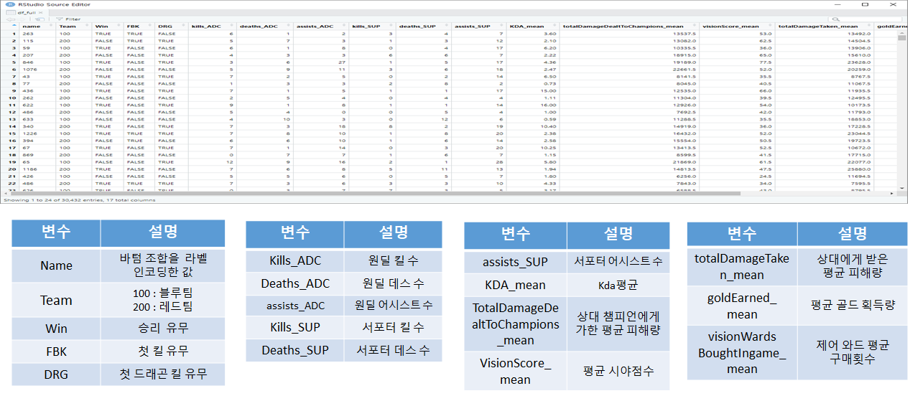

### 5. EDA

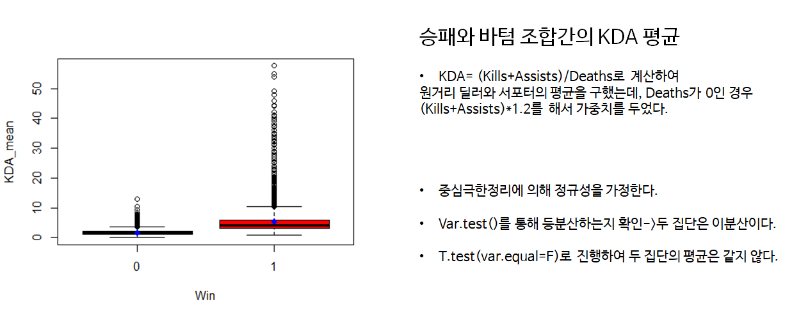

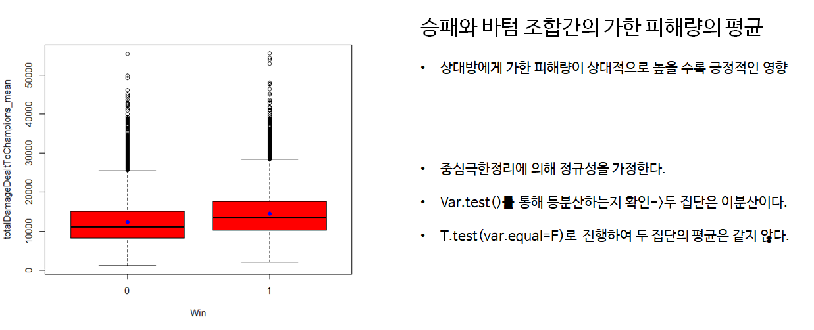

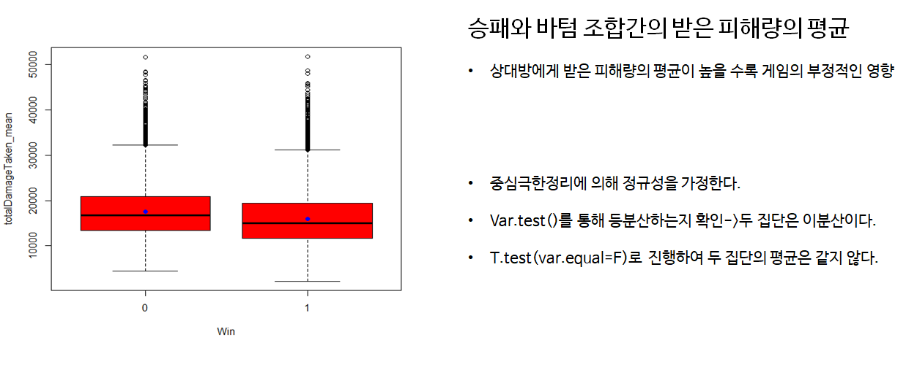

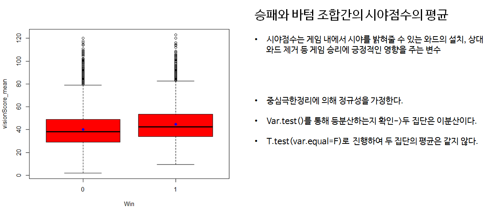

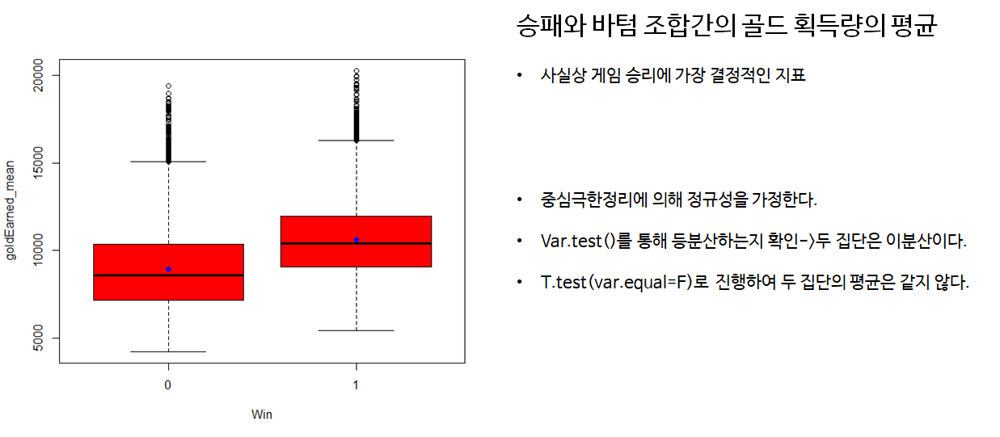

#### 바텀 듀오 조합별 승률 하위 10개 조합
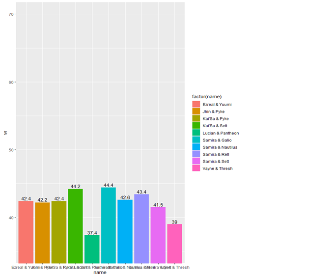

#### 바텀 듀오 조합별 승률 상위 10개 조합
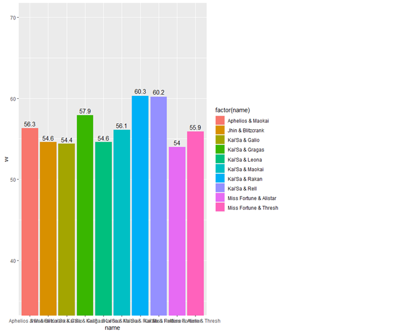

### 6. 모델링

* 본 프로젝트에서는 승률 예측을 위해 랜덤 포레스트를 사용했습니다.

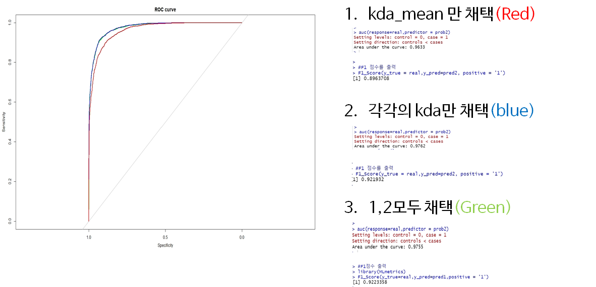

* KDA를 각각 넣은 컬럼과 KDA의 평균을 계산한 컬럼를 모두 넣었을 때 가장 좋은 성능을 보였다. 

### 7. 결론

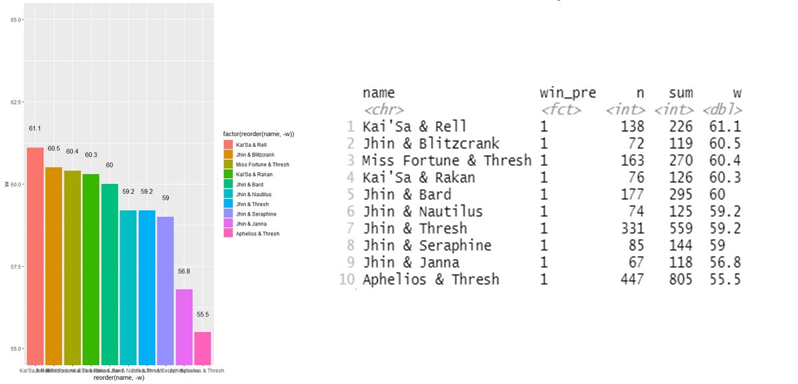

* 최근 게임을 플레이 하며 가장 좋다고 하는 조합이 상위에 랭크 되어 있었다. 

* 플레이어들이 소위 말하는 OP(Over Powered)챔피언 들이 상위에 속해 있어서 의미있는 결과가 나왔다고 생각함.

### 8. 프로젝트 한계점 및 개선점

* 라이엇 디펠로퍼 개발자 KEY를 활용한다면 시간 단축이 될 것이다.
 

* 최근 경기와 표본을 늘린다면 보다 유의미한 예측이 될 것이다.(최근 패치를 기준으로)

* 원거리 딜러와 서포터를 구분하는 조건이 완벽하지 않았다. 

* ACCURACY를 제외한 객관적인 상위에 랭크된 조합을 분별할 조건이 필요할 것 같다.

* 데이터 셋에 자기상관성을 갖는 컬럼들이 많다고 판단했다. 따라서 다중공선성 문제가 야기 될 것이라 생각한다. 이를 해결하기 위한 방법을 모색해야 한다. 

